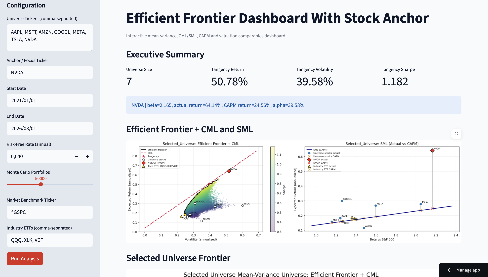

# Mag 7 Efficient Frontier Dashboard

A portfolio analytics project that combines Modern Portfolio Theory (MPT), CAPM, and valuation comparables into an interactive Streamlit dashboard.

The default universe is the **Magnificent 7** (`AAPL, MSFT, AMZN, GOOGL, META, TSLA, NVDA`) with **NVDA as anchor**.

## Live Demo

- Streamlit App: `https://investment-club-rcrctjlsdwowcsezrpohjh.streamlit.app/`
- GitHub Repository: `https://github.com/rafidshorim/Investment-Club`

## Portfolio Snapshot

- Built an interactive portfolio analytics dashboard for mean-variance optimization and CAPM diagnostics.
- Supports configurable universe, anchor ticker, benchmark, risk-free rate, and simulation size.
- Visualizes Efficient Frontier, CML, SML, tangency portfolio, and ticker-level return/risk tradeoffs.
- Designed for recruiter-friendly demonstration with clean UI and reproducible local/cloud setup.

## Why This Project

This project showcases an end-to-end investment analytics workflow suitable for career portfolios:

- Data ingestion with Yahoo Finance + fallback paths
- Monte Carlo portfolio simulation and efficient frontier extraction
- Tangency portfolio + Capital Market Line (CML)
- Security Market Line (SML) and CAPM comparison
- Relative valuation comparables in one view
- Interactive dashboard controls for real-time scenario analysis

## What It Computes

- Annualized return/volatility per stock
- Portfolio cloud from random long-only weights
- Efficient frontier from the simulated cloud
- Tangency portfolio (max Sharpe)
- CAPM expected return, beta, and alpha (actual - CAPM)
- Optional ETF context points for visual benchmarking
- Valuation panels (Forward P/E, Price/Sales, FCF Yield proxy, EV/EBITDA)

## Project Structure

- `Efficient_frontier.py`: core analytics engine + CLI entrypoint + plotting functions
- `app.py`: Streamlit dashboard frontend
- `.streamlit/config.toml`: dashboard appearance/runtime defaults
- `requirements.txt`: dependencies for local + cloud deploy
- `tests/test_smoke.py`: smoke tests for analysis and dashboard wiring

## Run Locally

### 1) Install

```bash
python3 -m venv .venv
source .venv/bin/activate
pip install -r requirements.txt
```

### 2) Script Mode (CLI)

```bash
python Efficient_frontier.py
```

This runs the full analysis, opens matplotlib charts, and prints summary tables.

### 3) Streamlit Dashboard

```bash
streamlit run app.py
```

Then open the local URL shown in terminal (typically `http://localhost:8501`).

## Dashboard Controls

- Universe tickers (comma-separated)
- Anchor/focus ticker
- Start/end date
- Risk-free rate
- Number of Monte Carlo portfolios
- Market benchmark ticker
- Industry ETF context tickers

The app runs analysis on click and renders:

- Efficient frontier + CML + SML panel
- Special universe frontier chart
- Valuation comparables chart
- Asset summary and tangency weights tables
- Focus ticker CAPM/actual signal card

## Deployment (Streamlit Community Cloud)

1. Push this repository to GitHub.
2. Go to [share.streamlit.io](https://share.streamlit.io) and connect your repo.
3. Set `app.py` as the entrypoint.
4. Deploy.

Because `requirements.txt` and `.streamlit/config.toml` are included at repo root, deployment is ready out of the box.

## Screenshots (Suggested Portfolio Additions)

Add these visuals to your GitHub repo and reference them in your profile/portfolio page.
Recommended folder: `images/`

- Efficient frontier and CML/SML panel from Streamlit
- Summary table screenshot with tangency weights

Example markdown (replace with your actual files):

```markdown



```

## Data & Method Notes

- Prices and fundamentals are sourced from Yahoo endpoints (`yfinance` + HTTP fallback).
- Analysis is long-only and fully invested (Dirichlet-sampled weights).
- Returns are annualized assuming 252 trading days.
- CAPM is benchmarked to `^GSPC` by default.
- Missing data can exclude some tickers from the final run.

## Limitations

- Public data APIs may be delayed, incomplete, or temporarily unavailable.
- Results are sensitive to date window and risk-free assumptions.
- Monte Carlo frontier is an approximation, not an exact optimizer.
- This is educational/portfolio tooling, not investment advice.

## Testing

Run smoke tests:

```bash
python -m unittest discover -s tests -p "test_*.py"
```

The tests validate:

- analysis pipeline contract (`run_analysis` returns expected structures)
- dashboard analysis entrypoint can run in headless mode with mocked data
